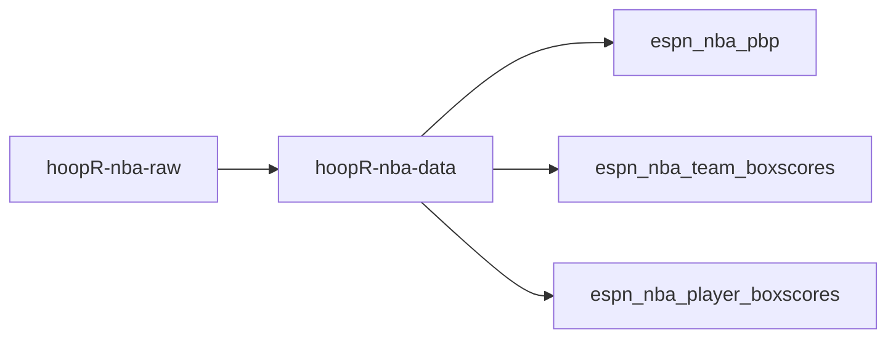
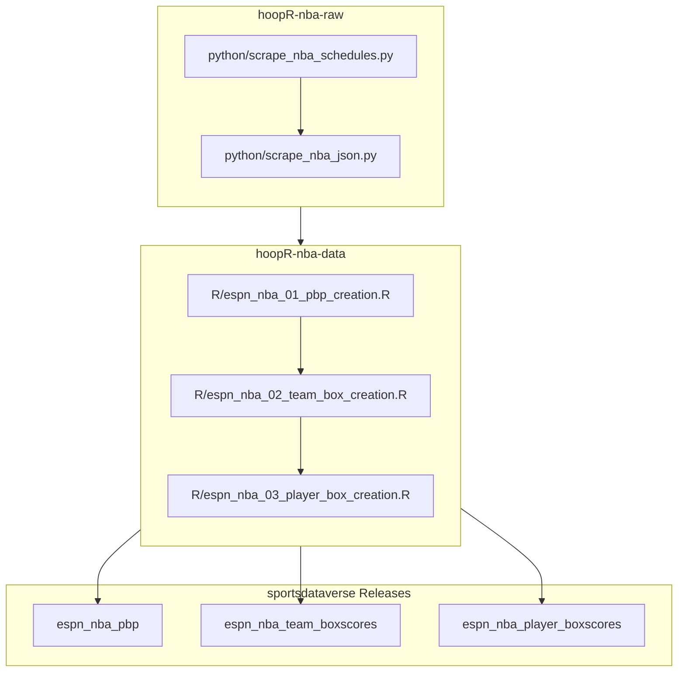

# hoopR-nba-data
hoopR NBA Data 2002 - Present

## hoopR ESPN NBA workflow diagram

[hoopR-nba-raw data repository (source: ESPN)](https://github.com/sportsdataverse/hoopR-nba-raw)

[hoopR-nba-data repository (source: ESPN)](https://github.com/sportsdataverse/hoopR-nba-data)

[hoopR-nba-stats-data Repo (source: NBA Stats)](https://github.com/sportsdataverse/hoopR-nba-stats-data)

[hoopR-mbb-raw data repository (source: ESPN)](https://github.com/sportsdataverse/hoopR-mbb-raw)

[hoopR-mbb-data repository (source: ESPN)](https://github.com/sportsdataverse/hoopR-mbb-data)

[hoopR-kp-data Repo (source: KenPom)](https://github.com/sportsdataverse/hoopR-kp-data)

## Automation & status

<!-- BEGIN GENERATED: status -->

| workflow | schedule | last run |
|---|---|---|
|  | days 18-31 07:00 UTC in Oct; daily 07:00 UTC in Nov-Dec; daily 07:00 UTC in Jan-Jun; days 1-12 07:00 UTC in Jul | 2026-08-19 |
|  | on push / PR / dispatch | 2026-08-26 |
|  | on push / PR / dispatch | 2026-08-27 |

| release tag | assets | size | last publish |
|---|---:|---:|---|
| [`espn_nba_schedules`](https://github.com/sportsdataverse/sportsdataverse-data/releases/tag/espn_nba_schedules) | 88 | 122.7 MB | 2026-08-26 |
| [`espn_nba_pbp`](https://github.com/sportsdataverse/sportsdataverse-data/releases/tag/espn_nba_pbp) | 79 | 6,081.8 MB | 2026-08-26 |
| [`espn_nba_team_boxscores`](https://github.com/sportsdataverse/sportsdataverse-data/releases/tag/espn_nba_team_boxscores) | 79 | 33.5 MB | 2026-08-26 |
| [`espn_nba_player_boxscores`](https://github.com/sportsdataverse/sportsdataverse-data/releases/tag/espn_nba_player_boxscores) | 79 | 420.7 MB | 2026-08-26 |
| [`espn_nba_rosters`](https://github.com/sportsdataverse/sportsdataverse-data/releases/tag/espn_nba_rosters) | 14 | 1.0 MB | 2026-08-19 |
| [`espn_nba_game_rosters`](https://github.com/sportsdataverse/sportsdataverse-data/releases/tag/espn_nba_game_rosters) | 80 | 204.9 MB | 2026-08-12 |
| [`espn_nba_player_core`](https://github.com/sportsdataverse/sportsdataverse-data/releases/tag/espn_nba_player_core) | 75 | 6.6 MB | 2026-08-12 |
| [`espn_nba_player_season_stats`](https://github.com/sportsdataverse/sportsdataverse-data/releases/tag/espn_nba_player_season_stats) | 80 | 106.6 MB | 2026-08-12 |
| [`espn_nba_team_season_stats`](https://github.com/sportsdataverse/sportsdataverse-data/releases/tag/espn_nba_team_season_stats) | 80 | 8.1 MB | 2026-08-12 |
| [`espn_nba_standings`](https://github.com/sportsdataverse/sportsdataverse-data/releases/tag/espn_nba_standings) | 80 | 4.3 MB | 2026-08-12 |
| [`espn_nba_officials`](https://github.com/sportsdataverse/sportsdataverse-data/releases/tag/espn_nba_officials) | 80 | 5.9 MB | 2026-08-12 |
| [`espn_nba_shots`](https://github.com/sportsdataverse/sportsdataverse-data/releases/tag/espn_nba_shots) | 80 | 896.7 MB | 2026-08-26 |
| [`espn_nba_draft`](https://github.com/sportsdataverse/sportsdataverse-data/releases/tag/espn_nba_draft) | 80 | 0.9 MB | 2026-08-19 |
| [`nba_crosswalk`](https://github.com/sportsdataverse/sportsdataverse-data/releases/tag/nba_crosswalk) | 25 | 0.7 MB | 2026-08-19 |

<!-- END GENERATED: status -->
